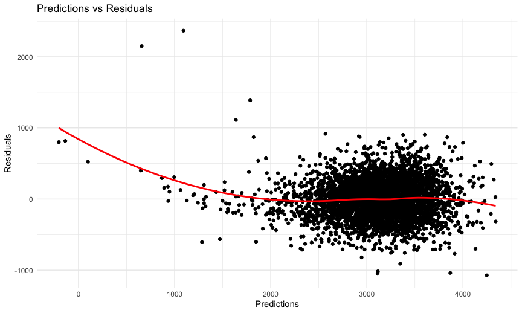
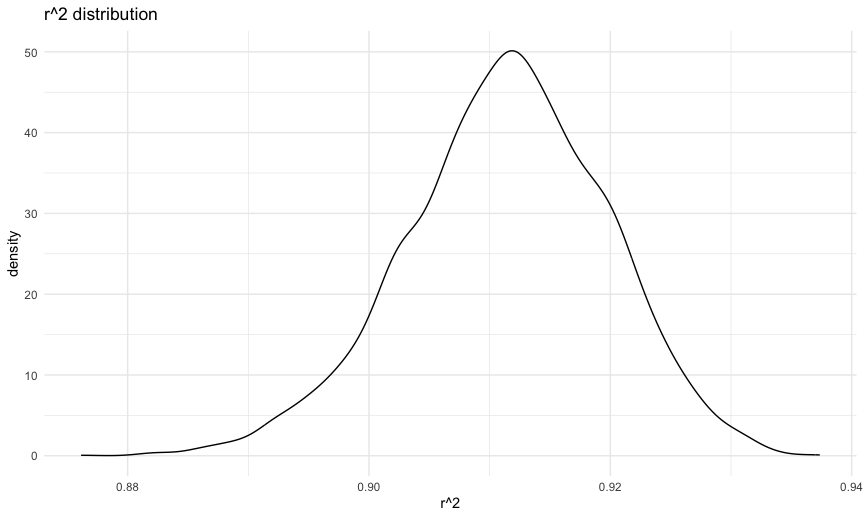

p8105_hw6_lk2776
================
2024-12-02

## problem 2

``` r
#problem2
data = read_csv("./data/homicide-data.csv", na=c("Unknown",".",""), ) |>
  janitor::clean_names() |>
  drop_na() |>
  mutate(city_state = paste(city, state, sep="_"), 
         status = if_else(
           disposition %in% c("Closed without arrest", "Open/No arrest"), "1", "0")) |>
 filter(!city_state %in% c("Tulsa_AL","Dallas_TX","Phoenix_AZ","Kansas City_MO")) |>
  filter(victim_race %in% c("White","Black")) |>
  mutate(victim_age = as.numeric(victim_age), 
         status = as.numeric(status))
```

    ## Rows: 52179 Columns: 12
    ## ── Column specification ────────────────────────────────────────────────────────
    ## Delimiter: ","
    ## chr (8): uid, victim_last, victim_first, victim_race, victim_sex, city, stat...
    ## dbl (4): reported_date, victim_age, lat, lon
    ## 
    ## ℹ Use `spec()` to retrieve the full column specification for this data.
    ## ℹ Specify the column types or set `show_col_types = FALSE` to quiet this message.

``` r
#baltimore logistic
baltimore_data = data |>
  filter(city_state == "Baltimore_MD") 

fit_logistic =
  baltimore_data |>
  glm(status ~ victim_age + victim_race + victim_sex, data = _, family = binomial()) |>
  broom::tidy(conf.int=TRUE) |>
  mutate(OR = exp(estimate),
         conf.low = exp(conf.low),
         conf.high = exp(conf.high)) |>
  select(term, log_OR = estimate, OR, conf.low,conf.high,p.value) |>
  filter(term == "victim_sexMale")
  
#fit_logistic |> knitr::kable()
```

``` r
#all cities - fit logistic
all_cities_fit_logistic = data |> 
  group_by(city_state) |>
  nest() |>
  mutate(models = map(data, \(df) glm(status ~ victim_age + victim_race + victim_sex, data = df, family = binomial())),
  results = map(models, broom::tidy,conf.int=TRUE)) |>
  select(-data, -models) |>
  unnest(results) |>
  mutate(OR = exp(estimate),
         conf.low = exp(conf.low),
         conf.high = exp(conf.high)) |>
  select(term, log_OR = estimate, OR, conf.low,conf.high,p.value) |>
  filter(term == "victim_sexMale") 
```

    ## Adding missing grouping variables: `city_state`

``` r
#all_cities_fit_logistic |> knitr::kable()
```

The below plot shows gender based differences across city\_ state in
resolving the crimes. Male victim crimes are more likely to be resolved
from fresno_CA to SanBernardino_CA (left to right direction) compared to
female victim crimes.

``` r
all_cities_fit_logistic |>
 # mutate(city_state = fct_reorder(city_state,OR)) |> #not working
ggplot(aes(x= reorder(city_state,OR), y = OR)) + 
  geom_point() +
  theme(axis.text.x = element_text(angle = 80, hjust
= 1))+
  geom_errorbar(aes(ymin=conf.low, ymax = conf.high), color = "orange") +
  labs(
    title = "OR across Cities, States",
    x = "City, State",
    y = "OR"
  )
```


## problem3

The modeling process for the initial analysis involves nesting models:
Simple regression model is fitted using babysex, bhead, and blength as
predictors. A full model, which includes additonal predictors, is then
fitted, and the significance of the models using ANova. Since the anova
values is less than 0.05, the full model explains more variation.
Homoskedasticity, linearity and presence of outliers can be observed in
the residulas vs fitted values plot. Two other models are compared with
full model using cross validation. The RMSE for full models is lower
than for the two other models, making it the preferred model.

``` r
bwt_data = read_csv("./data/birthweight.csv", na=c(" ",".","")) |>
  janitor::clean_names() |>
  drop_na() |>
  mutate(
    babysex = as.factor(babysex),
    malform = as.factor(malform),
    frace = as.factor(frace),
    mrace = as.factor(mrace)
  )
```

    ## Rows: 4342 Columns: 20
    ## ── Column specification ────────────────────────────────────────────────────────
    ## Delimiter: ","
    ## dbl (20): babysex, bhead, blength, bwt, delwt, fincome, frace, gaweeks, malf...
    ## 
    ## ℹ Use `spec()` to retrieve the full column specification for this data.
    ## ℹ Specify the column types or set `show_col_types = FALSE` to quiet this message.

``` r
#str(bwt_data)
```

``` r
#model 1
#nested model process of selecting variables 
simple_model_1 = lm(bwt ~ babysex + bhead + blength, data = bwt_data) #baby's variables

full_model_1 = lm(bwt ~ babysex + bhead + blength+ delwt + fincome + frace + gaweeks + malform +
              mrace + pnumlbw + smoken + wtgain, data = bwt_data) 

anova(simple_model_1, full_model_1)|>
  broom::tidy() #p-value less than 0.05 
```

    ## # A tibble: 2 × 7
    ##   term                      df.residual    rss    df   sumsq statistic   p.value
    ##   <chr>                           <dbl>  <dbl> <dbl>   <dbl>     <dbl>     <dbl>
    ## 1 bwt ~ babysex + bhead + …        4338 3.61e8    NA NA           NA   NA       
    ## 2 bwt ~ babysex + bhead + …        4325 3.22e8    13  3.88e7      40.0  6.85e-97

``` r
bwt_data = bwt_data |>
  add_predictions(full_model_1) |> #pred
  add_residuals(full_model_1) #resid

bwt_data |> 
  ggplot(aes(x = pred, y = resid)) +
  geom_point() +
  geom_smooth(method = "loess", se = FALSE,color="red" ) #methods 1
```

    ## `geom_smooth()` using formula = 'y ~ x'



``` r
  labs(
    title = "Predictions vs Residuals",
    x = "Predictions",
    y = "Residuals"
  ) 
```

    ## $x
    ## [1] "Predictions"
    ## 
    ## $y
    ## [1] "Residuals"
    ## 
    ## $title
    ## [1] "Predictions vs Residuals"
    ## 
    ## attr(,"class")
    ## [1] "labels"

``` r
#main effects
model_2 = lm(bwt ~  blength + gaweeks, data = bwt_data)
model_2 |> 
  broom::tidy() |>
  select(term, estimate, p.value) 
```

    ## # A tibble: 3 × 3
    ##   term        estimate  p.value
    ##   <chr>          <dbl>    <dbl>
    ## 1 (Intercept)  -4348.  0       
    ## 2 blength        129.  0       
    ## 3 gaweeks         27.0 2.36e-54

``` r
#main effects + interactions
model_3 = lm(bwt ~ bhead * blength * babysex, data = bwt_data)

model_3 |> 
  broom::tidy() |>
  select(term, estimate, p.value) 
```

    ## # A tibble: 8 × 3
    ##   term                    estimate      p.value
    ##   <chr>                      <dbl>        <dbl>
    ## 1 (Intercept)            -7177.    0.0000000149
    ## 2 bhead                    182.    0.00000184  
    ## 3 blength                  102.    0.0000992   
    ## 4 babysex2                6375.    0.000147    
    ## 5 bhead:blength             -0.554 0.478       
    ## 6 bhead:babysex2          -198.    0.000105    
    ## 7 blength:babysex2        -124.    0.000429    
    ## 8 bhead:blength:babysex2     3.88  0.000245

``` r
cv_df = crossv_mc(bwt_data, 100) |>
  mutate(
    train = map(train, as_tibble),
    test = map(test, as_tibble))
  
cv_df =
  cv_df |>
  mutate(
    full_model_1_b  = map(train, \(df) lm(bwt ~ babysex + bhead + blength+ delwt + fincome + frace + gaweeks + malform +
              mrace + pnumlbw + smoken + wtgain, data = df)),
    model_2_b  = map(train, \(df) lm(bwt ~  blength + gaweeks, data = df)),
    model_3_b  = map(train, \(df) lm(bwt ~ bhead * blength * babysex, data = df))) |>
  mutate(
    rmse_full_model = map2_dbl(full_model_1_b, test, \(mod, df) rmse(model = mod, data = df)),
    rmse_mode_l2 = map2_dbl(model_2_b, test, \(mod, df) rmse(model = mod, data = df)),
    rmse_model_3 = map2_dbl(model_3_b, test, \(mod, df) rmse(model = mod, data = df)))


cv_df |>
  select(starts_with("rmse")) |>
  pivot_longer(
    everything(),
    names_to = "model",
    values_to = "rmse",
    names_prefix = "rmse_") |>
  mutate(model = fct_inorder(model)) |>
  ggplot(aes(x = model, y = rmse)) + geom_violin() +
  labs(title = "RMSE across Models", x = "Model", y = "RMSE")
```


## problem1

``` r
weather_df =
  rnoaa::meteo_pull_monitors(
    c("USW00094728"),
    var = c("PRCP", "TMIN", "TMAX"),
    date_min = "2017-01-01",
    date_max = "2017-12-31") %>%
  mutate(
    name = recode(id, USW00094728 = "CentralPark_N
Y"),
    tmin = tmin / 10,
    tmax = tmax / 10) %>%
  select(name, id, everything())
```

    ## using cached file: /Users/lk/Library/Caches/org.R-project.R/R/rnoaa/noaa_ghcnd/USW00094728.dly

    ## date created (size, mb): 2024-10-30 10:12:14.75696 (8.656)

    ## file min/max dates: 1869-01-01 / 2024-10-31

``` r
boot_strap_results = weather_df |> 
  modelr::bootstrap(n = 5000) |>
  mutate(
    models = map(strap, \(df) lm(tmax ~ tmin, data = df)),
   results = map(models, \(model) {glance_v = broom::glance(model) 
      tidy_v = broom::tidy(model) |>
        filter(term != "(Intercept)") |>
        pull(estimate)
      logb0_logb1 = log(tidy_v[1] * tidy_v[2])  
      tibble(
        r_squared = glance_v$r.squared,
        logb0_logb1 = logb0_logb1
      )})) |>
  select(results) |>
  unnest(results)
```

``` r
boot_strap_results |>
  ggplot(aes(x = r_squared)) +
  geom_density() +
  labs(title = "r^2 distribution",
       x = "r^2", 
       y = "density") 
```



``` r
conf_intervals = boot_strap_results |>
  summarize(rsqured_ci = quantile(r_squared, probs = c(0.025, 0.975))
  ) 
```

    ## Warning: Returning more (or less) than 1 row per `summarise()` group was deprecated in
    ## dplyr 1.1.0.
    ## ℹ Please use `reframe()` instead.
    ## ℹ When switching from `summarise()` to `reframe()`, remember that `reframe()`
    ##   always returns an ungrouped data frame and adjust accordingly.
    ## Call `lifecycle::last_lifecycle_warnings()` to see where this warning was
    ## generated.

``` r
conf_intervals
```

    ## # A tibble: 2 × 1
    ##   rsqured_ci
    ##        <dbl>
    ## 1      0.894
    ## 2      0.927
